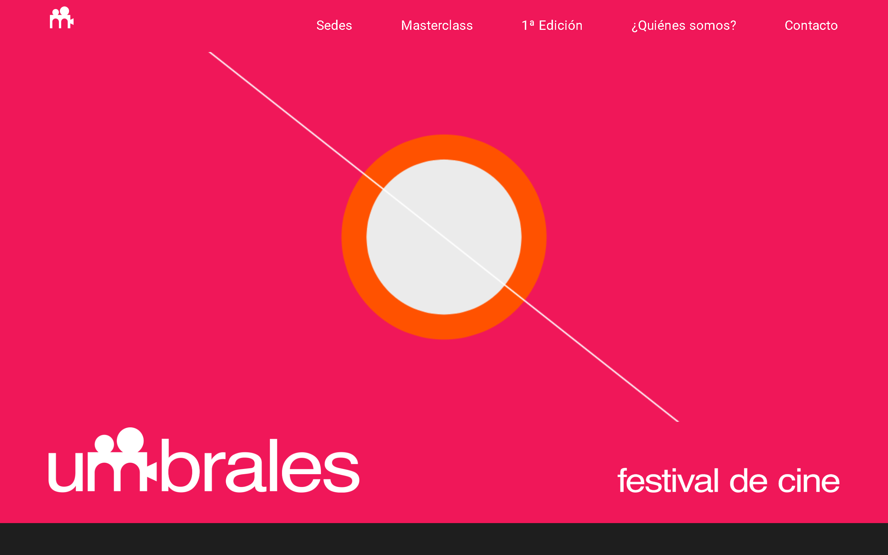

# 🎬 Umbrales – Festival de Cine

**Umbrales** es un festival de cine que sirve como punto de encuentro para espectadores, creadores y comunidad cinematográfic. Este repositorio contiene el código  del sitio web oficial del festival.

## 🌐 Sitio web

[Visita el sitio oficial](https://umbralesfest.com/) 




## 📁 Estructura del proyecto


```bash
.
├── index.html               # Página principal con descripción del festival y últimas noticias
├── sedes.html               # Información de sedes y espacios culturales
├── Masterclass.html         # Información de Masterclass
├── 1ª Edición.html          # Información de la primera edición
├── quienes-somos.html       # Información general
├── Contacto.html            # Información de cotacto
├── css/
│   └── normalize.css        # Normalize.css para estilos consistentes entre navegadores
│   └── styles.css           # Estilos globales (colores, tipografía, diseño responsivo) 
├── js/
│   └── carrusel.js
│   └── preloader.js
│   └── script.js
│   └── sketch.js
│   └── slide_masterclass.js                   
├── assets/
└── README.md                # Este archivo


